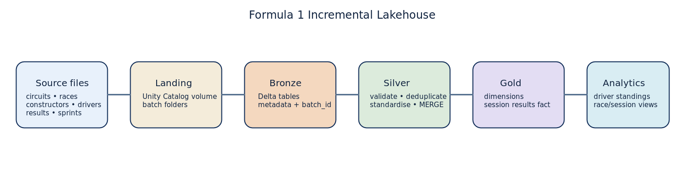
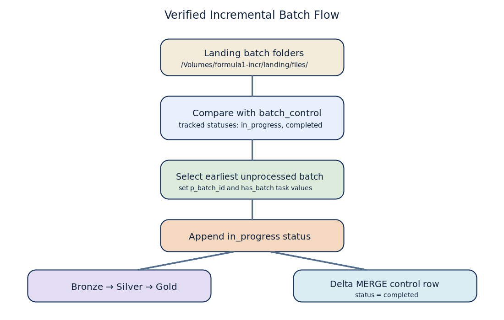
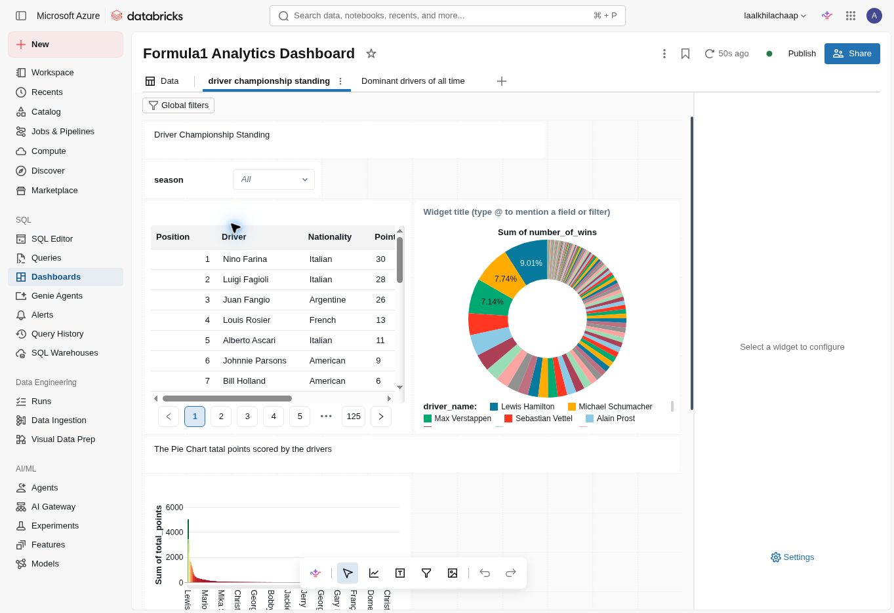
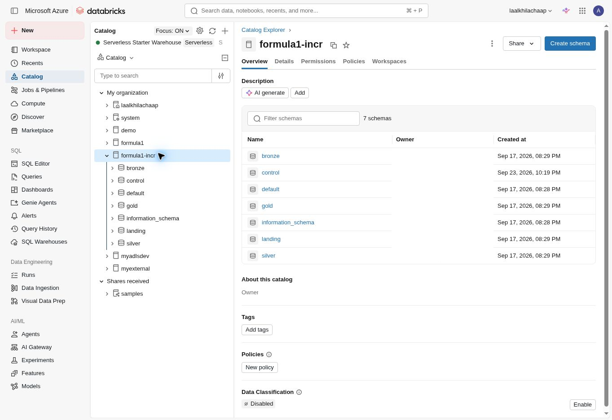
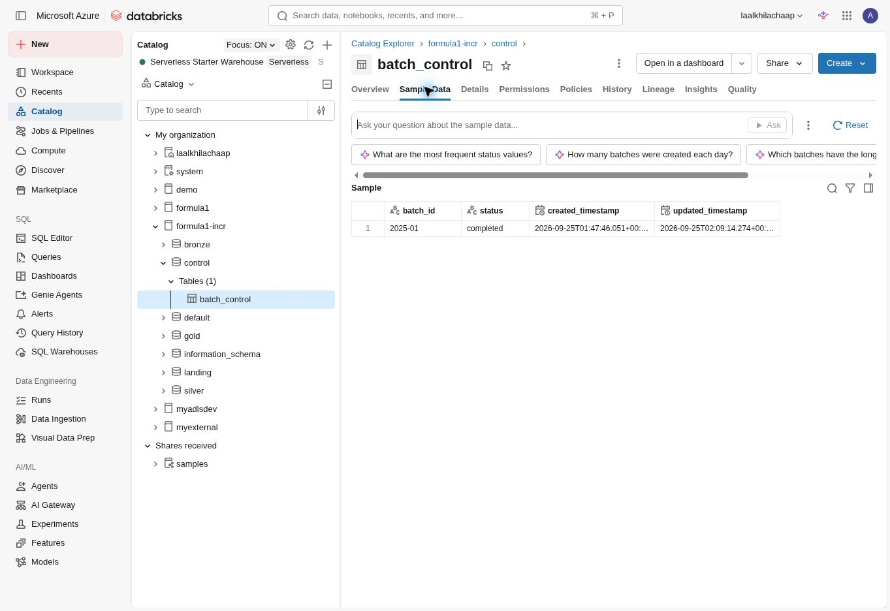
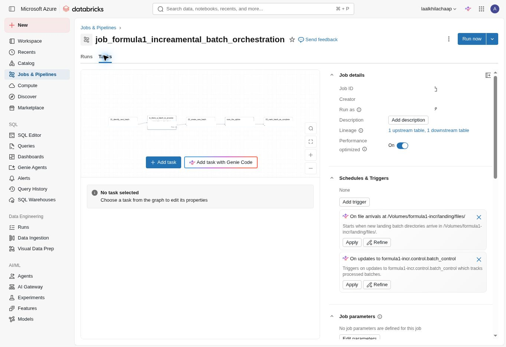
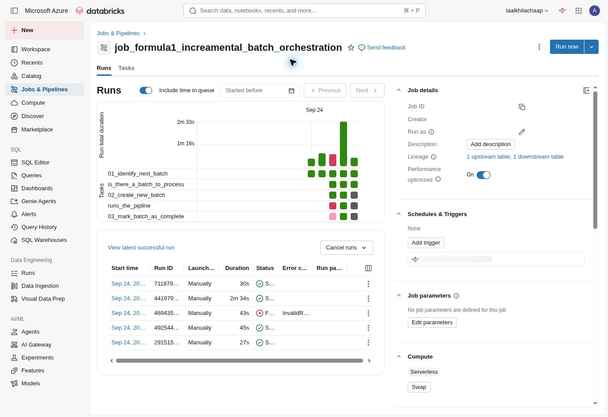
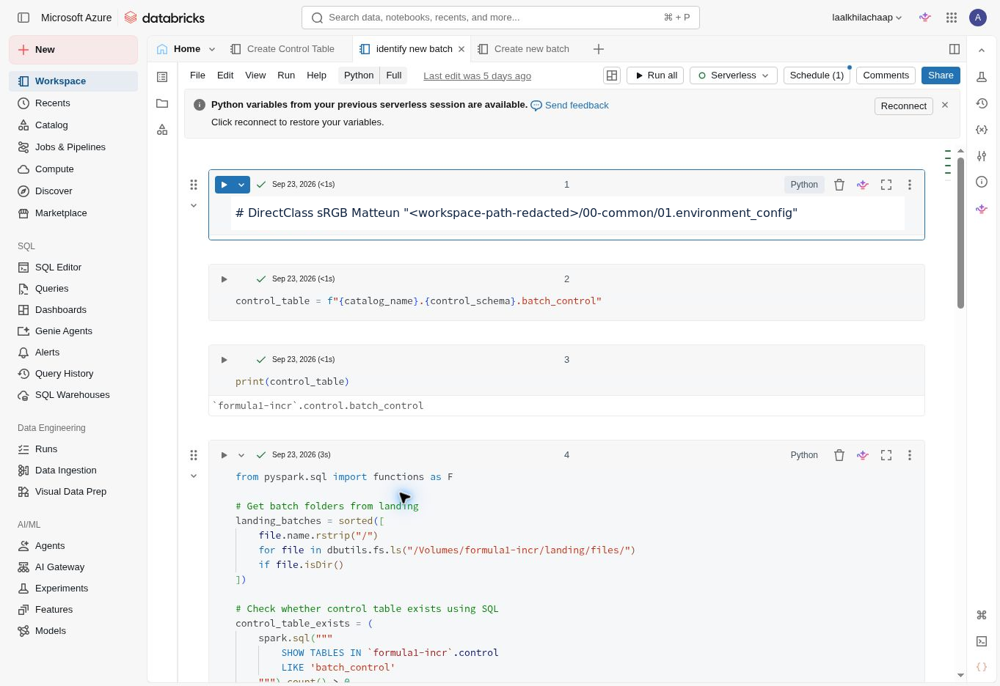

# Formula 1 Incremental Lakehouse on Azure Databricks
.

## Overview

This project builds a Formula 1 analytical lakehouse in Azure Databricks using the Medallion Architecture. Formula 1 source files are organised in landing batches, ingested into Bronze Delta tables, transformed into Silver analytical tables, and modelled into Gold dimensions and a session-results fact table. A control table makes the process incremental by choosing the earliest landing batch that has not already been started or completed.

The exported project targets the Unity Catalog `formula1-incr` and uses the schemas `landing`, `bronze`, `silver`, `gold`, and `control`.

## Business and analytics goal

Create trustworthy Formula 1 data suitable for driver standings and race/session analysis. The source domains implemented in the notebooks are circuits, races, constructors, drivers, results, and sprints.

## Technology stack

- Azure Databricks and Lakeflow/Databricks Jobs
- Unity Catalog, volumes, external locations, schemas and managed tables
- Delta Lake and Delta `MERGE`
- PySpark DataFrame API and Spark SQL
- Azure Data Lake Storage Gen2 (ABFSS paths in the setup notebook)

## Architecture





### Landing

`formula1-incr.landing.files` is an external volume. Batch folders are enumerated at `/Volumes/formula1-incr/landing/files/`; the verified successful run showed batch `2025-01`.

### Bronze

Bronze notebooks ingest the six Formula 1 domains and add source-file/ingestion metadata plus `batch_id`. The bronze helper writes Delta tables with `replaceWhere` for the current batch.

### Silver

Silver notebooks filter each bronze table by `p_batch_id`, select and rename columns, validate required keys, deduplicate records, standardise selected names, then upsert using the Silver helper. The helper uses Delta `MERGE`, updating matched rows only when `s.batch_id >= t.batch_id`.

### Gold and analytics

Gold notebooks build `dim_races`, `dim_constructors`, `dim_drivers`, and `fact_session_results`. Results and sprint sessions are unioned with a `session_type`; derived flags include `is_win`, `is_podium`, and `has_points`. The exported SQL also contains a driver-standing view.

## Incremental batch processing

The actual `identify new batch` notebook:

1. Lists landing subfolders with `dbutils.fs.ls`.
2. Checks that `formula1-incr.control.batch_control` exists using `SHOW TABLES`.
3. Reads distinct batch IDs whose status is `in_progress` or `completed`.
4. Subtracts tracked IDs from landing IDs, sorts the result, and chooses the first one.
5. Publishes `p_batch_id` and `has_batch` via `dbutils.jobs.taskValues`.

`Create new batch` appends an `in_progress` row; `complete batch` uses Delta `MERGE` to change that row to `completed`.

See [docs/incremental-processing.md](docs/incremental-processing.md) for the precise implementation notes.

## Repository layout

```text
notebooks/
  01_setup/        Unity Catalog setup and reusable helpers
  02_bronze/       Batch ingestion notebooks
  03_silver/       Cleansing, standardisation and upserts
  04_gold/         Dimensions and session-results fact table
  05_incremental/  Control table and batch orchestration
sql/               Driver-standing view
architecture/      Derived architecture diagrams
docs/              Implementation notes and notebook inventory
```

## Databricks execution evidence

These uncropped workspace captures document the actual Azure Databricks implementation. Personal identifiers and job metadata that are not needed for the portfolio were redacted while preserving the surrounding UI and execution context.

| Evidence | Capture |
| --- | --- |
| Formula 1 driver standings dashboard |  |
| Unity Catalog `formula1-incr` schemas |  |
| Completed `2025-01` control record |  |
| Incremental Job task graph |  |
| Job runs with successful executions |  |
| Next-batch detection notebook |  |

The catalog capture shows the implemented `bronze`, `control`, `gold`, `landing`, and `silver` schemas. The control-table capture shows `batch_id`, `status`, timestamps, a completed `2025-01` batch, and the table's Delta type.

## Authenticity and privacy

The notebook export has been preserved as source `.py`/`.sql` files. Personal workspace paths were replaced with `<your-workspace-folder>` before publication. No passwords, access tokens, SAS tokens, storage keys, connection strings, subscription IDs, tenant IDs, or private URLs are included.

One observed implementation detail is intentionally preserved in the sources: several Gold/view references still point to `formula1` rather than `formula1-incr` for reference/analytics objects. This README reports that fact rather than silently claiming all objects use one catalog.

## Engineering concepts demonstrated

- Unity Catalog object and volume design
- Batch-aware Bronze ingestion
- Metadata enrichment and Delta writes
- Key validation, deduplication, column standardisation and joins
- Idempotent-ish Delta upserts using `MERGE`
- Batch-control state management and task-value handoff
- Star-schema-oriented Gold dimensions and fact data

## What I learned

I practised connecting Unity Catalog organisation to a practical Medallion pipeline, working with batch parameters, debugging notebook paths and catalog references, using Delta upserts, and explaining end-to-end lineage from landing files to analytical outputs.
